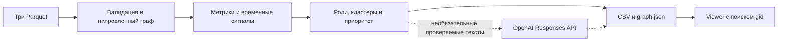

# Граф денег

## Название проекта

**Граф денег** — локальный анализ обезличенной сети переводов.

## Краткое описание

AML-аналитику известен 81 исходный клиент, а исследовать нужно сеть из
2 248 узлов. Программа строит направленный граф, назначает каждому узлу
основную структурную роль и показывает, кого проверить первым и почему.
Роли и приоритеты — гипотезы по неполной выгрузке, не вывод о виновности.

## Что реализовано

| Функция | Доказательство | Код |
|---|---|---|
| Проверка трёх Parquet и согласованности переводов | [EVIDENCE: I1 и этап 5](docs/EVIDENCE.md), живой запуск и тест | [pipeline.py](pipeline.py) |
| Метрики, роли, объяснения, кластеры Louvain и топ | [EVIDENCE: I1–I4](docs/EVIDENCE.md), живой запуск и тест | [pipeline.py](pipeline.py) |
| Viewer с направлением связей и поиском `gid` | [EVIDENCE: I2–I3](docs/EVIDENCE.md), браузерная проверка | [viewer/index.html](viewer/index.html) |
| Временные признаки | [EVIDENCE: I3](docs/EVIDENCE.md), сверка с Parquet и тест | [temporal.py](temporal.py) |
| Циклы, цепочки, дробление и устойчивость | [EVIDENCE: I4](docs/EVIDENCE.md), живой запуск и тест | [structural.py](structural.py) |
| Проверяемые LLM-тексты для 8 кластеров и 5 узлов | [EVIDENCE: этап 5](docs/EVIDENCE.md), живой запуск и mock тест | [cluster_llm.py](cluster_llm.py), [node_llm.py](node_llm.py) |
| Отдельный read-only CLI-ассистент по готовому графу: шесть function tools, сверка каждого `gid` и числа | [EVIDENCE: I5](docs/EVIDENCE.md), три live-вопроса и тест без модели | [ask.py](ask.py), [test_ask.py](tests/test_ask.py) |
| Локальная панель ассистента с guard и проверкой границ | [EVIDENCE: I6](docs/EVIDENCE.md), пять live-вопросов и policy-тесты; снимок панели ожидается | [serve.py](serve.py), [input_check.py](input_check.py), [viewer/index.html](viewer/index.html) |

Обязательные файлы: `out/nodes_roles.csv`, `out/clusters.csv`,
`out/top_nodes.csv`. Дополнительные: `out/graph.json`,
`out/robustness.csv`, `out/completeness.md`.

## Как работает решение

Аналитик запускает расчёт и открывает viewer. Первый в топе —
`gid 100000003684369100`, роль `coordinator`, приоритет `0.779`.
Экспортированное для его карточки объяснение:

> На координацию указывают 24 плательщика, 62 получателя и путь от 9 исходных клиентов. Связан с 9 другими кластерами. Вход неполон. Участвует в 1 возвратной цепочке и 63 повторяющихся маршрутах.

Поиск `100000000850297100` показывает транзит с равными наблюдаемыми
входом и выходом 17 520 KZT. Поиск `100000004265639100` показывает
обрыв четвёртого колена и оговорку «конечность не доказана». Дословные
значения и результаты viewer приведены в [EVIDENCE](docs/EVIDENCE.md).

### Критерии ролей

Выбирается первое подходящее правило сверху вниз. Степень — число разных
контрагентов; `pass_through = out_kzt / in_kzt` при положительном входе.

| Роль | Порог |
|---|---|
| `coordinator` | `in_deg ≥ 5`, `out_deg ≥ 10`, путь от ≥ 2 seed и связь с ≥ 2 другими кластерами либо betweenness в топ-5% своей слабосвязной компоненты |
| `consolidator` | `in_deg ≥ 5` |
| `distributor` | `out_deg ≥ 10` |
| `transit` | не seed, положительные вход и выход, `0.8 ≤ pass_through ≤ 1.2` |
| `terminal` | `depth < 4`, положительный вход, `out_deg = 0` |
| `peripheral` | остальные узлы, в том числе обрывы глубины 4 |

`role_score` оценивает силу признака. `priority_score` объединяет входящую
степень и сумму, betweenness, достижимые seed и вес роли. Обрыв четвёртого
колена снижает оба скора. Точные формулы: [PLAN §4](docs/PLAN.md) и
[ONTOLOGY §7](docs/ONTOLOGY.md).

Дополнительные сигналы: быстрый выход через 1–2 дня, синхронные входы,
всплески, циклы длины 2–6, цепочки A→B→C с минимум двумя переводами на
каждом ребре и минимум три перевода по 5 000–6 000 KZT одному получателю
за день. `robustness.csv` показывает компоненты и seed, потерявшие
направленный путь к оставшимся `consolidator`/`coordinator` после удаления
топ-5/10/20 узлов; роли при этом не пересчитываются.

## Технологии

Python 3.9+ (проверено на 3.9.6); pandas, pyarrow, NetworkX,
NumPy, SciPy, openai, python-dotenv
([границы версий](requirements.txt)). Viewer — HTML/JS и локальная
копия Cytoscape.js 3.34.3. Необязательные тексты используют OpenAI
Responses API и `OPENAI_MODEL=gpt-6-sol` в проверенном live-прогоне.
Роли, скоры и топ модель не вычисляет.

## Архитектура проекта



[pipeline.py](pipeline.py) валидирует вход, считает и проверяет выходы;
[temporal.py](temporal.py) и [structural.py](structural.py) считают
детерминированные сигналы. Viewer читает `out/graph.json` через локальный
HTTP-сервер. Неверный вход завершает CLI с сообщением `V-01`–`V-03`.
Для панели `serve.py` отдаёт тот же viewer и `out/`, принимает вопрос,
вызывает [input_check.py](input_check.py) и затем существующий
[ask.py](ask.py). Проверка и ответ используют `OPENAI_MODEL`; API-ключ
остаётся на сервере.

### Масштабирование до 1 млн узлов

На таком размере точный betweenness и объекты NetworkX станут узким
местом. Нужны потоковое чтение Parquet, компактное хранение рёбер,
обработка по компонентам и приближённый betweenness с оценкой ошибки.
Эта версия проверена на 2 248 узлах; 1 млн узлов — **NOT_VERIFIED**.

## Установка и запуск

Нужны Python 3.9+, `git` и доступ к PyPI при установке. Проверено на
Python 3.9.6. Все три Parquet находятся в `data/` репозитория.
Команды на macOS/Linux:

```sh
git clone https://github.com/BAITC-Hacks/hack-a716d39d-builoff.git
cd hack-a716d39d-builoff
python3 -m venv .venv
.venv/bin/python -m pip install -r requirements.txt
.venv/bin/python pipeline.py --data data --out out
```

На Windows используйте `.venv\Scripts\python` вместо `.venv/bin/python`.
Файл `.env` для обязательного расчёта не нужен: без него программа сообщает
`LLM skipped` и сохраняет результаты. Для необязательных гипотез скопируйте
`.env.example` в `.env`, внесите ключ, предоставленный для проверки,
и задайте `OPENAI_MODEL`. Флаг `--no-llm`
пропускает оба LLM-вызова при любом содержимом `.env`.

| Имя | Назначение | Обязательно |
|---|---|---|
| `OPENAI_API_KEY` | ключ для дополнительных текстов; не хранить в git | нет |
| `OPENAI_MODEL` | модель Responses API | только с ключом |

Успешная команда заканчивается `wrote: ...` и `elapsed_seconds=...`.
Затем из корня репозитория в другом терминале:

```sh
python3 -m http.server 8000 --bind 127.0.0.1
```

Чтобы пользоваться панелью «Спросить ассистента», вместо этой команды
запустите сервер из репозитория (после создания `.env` с ключом и моделью):

```sh
.venv/bin/python serve.py --port 8000 --bind 127.0.0.1
```

Откройте `http://127.0.0.1:8000/viewer/`. Введите полный 18-значный
`gid`; клик по соседу открывает его карточку. Стрелки показывают
направление перевода. Локальный HTTP-сервер нужен для `graph.json`.
Обычный `http.server` по-прежнему открывает граф и поиск; панель в этом
режиме показывает «Запустите python serve.py». Отдельного production-сервера
и Docker нет.

## Как проверить решение

### Доступ для проверки

Три Parquet включены в репозиторий; личный аккаунт участника не нужен.
Обязательные расчёт и viewer работают без ключа. Ключ OpenAI для
необязательных текстов эксперт получает по договорённости с организаторами.
Без ключа программа сообщает `LLM skipped` и сохраняет обязательные файлы.

### Ассистент

После расчёта можно задать отдельный вопрос ассистенту:

```sh
.venv/bin/python ask.py 'что известно о 100000005382566100?'
```

CLI читает готовые `out/nodes_roles.csv`, `out/clusters.csv` и
`out/graph.json`, использует `OPENAI_API_KEY` и `OPENAI_MODEL` из `.env`.
Та же логика доступна в панели viewer при запуске `serve.py`: локальный
`POST /api/ask` принимает JSON `{"question":"..."}` и возвращает
`answer`, `terminal`, `checks`. Перед агентом один структурированный вызов
модели проверяет prompt injection и границы онтологии (§1, 2, 9).
`guard` reject или высокий риск и `ontology` reject завершают запрос
отказом; `clarify` передаёт агенту подсказку. При техническом сбое проверки
`checks` содержит `skipped` с причиной, а агент продолжает работу. Стадии
`validate`, `check`, `agent` и бейджи проверок видны под полем вопроса.
Его tools: `find_node`, `neighbors`, `top_by_role`, `paths_from_seeds`,
`cluster_members`, `search_by_metric`. После ответа код сверяет все `gid`
и числа с фактически возвращёнными результатами tools; при расхождении
добавляет `[не подтверждено]`. Без ключа сообщает об этом и выходит с
кодом 0. Ответы являются гипотезами по наблюдаемому графу.

```sh
.venv/bin/python -m unittest discover -s tests -v
.venv/bin/python pipeline.py --data data --out out --no-llm
.venv/bin/python ask.py 'кто собирает деньги с seed-клиентов?'
.venv/bin/python ask.py 'что известно о 100000005382566100?'
.venv/bin/python ask.py 'какие узлы связывают кластеры 3 и 16?'
```

Фактический вывод, edge cases и AC — в [EVIDENCE](docs/EVIDENCE.md).
Пятиминутный сценарий: выполнить расчёт, открыть viewer и найти
`100000003684369100` (`coordinator`), `100000000850297100` (`transit`),
`100000004265639100` (обрыв, `peripheral`), затем несуществующий `gid 999`.

| Проверка | Фактическое поведение |
|---|---|
| Пустая папка `--data` | код 1, `ERROR: V-01: missing .../nodes.parquet` |
| Битый `edges.parquet` | код 1, `ERROR: V-01: cannot read ... Parquet magic bytes not found` |
| Несогласованный агрегат | тест: `V-03`, выгрузки не создаются |
| Неизвестный `gid` | viewer: «Узел ... не найден в предоставленной сети.» |
| Нет `OPENAI_API_KEY` | расчёт успешен, дополнительные тексты пропущены |
| Обрыв четвёртого колена | ни один из 444 обрывов не назван `terminal` |

## Данные и интеграции

Источник — предоставленные организаторами [данные](data/README.md):
2 248 узлов, 3 119 направленных рёбер, 4 840 отдельных переводов за
2026-07-01…2026-07-31. Выгрузка охватывает только исходящие
внутрибанковские переводы от 5 000 KZT на глубину четырёх колен.
Дополнительная интеграция с OpenAI получает агрегаты выбранных кластеров
и узлов при настроенном ключе. Роли и топ считаются локально.
`out/completeness.md` описывает недостающие данные и следующий запрос.

## Ограничения

Нет переводов ниже 5 000 KZT, за пределами периода и вне банка. Вход
seed неполон; 444 узла обрываются на четвёртом колене. Поэтому роль
`terminal`, признаки дробления и приоритет требуют проверки на более
полных данных. Нет AML-вердикта, авторизации и онлайн-обновления.

Предоставленные данные и [starter/](starter/) использованы как исходный
материал. Процессные `AGENTS.md`, `docs/PROCESS.md` и
`docs/ONTOLOGY_GUIDE.md` подготовлены до соревновательной части;
код решения, онтология, план и доменные тексты созданы во время неё.
Библиотеки и модель перечислены в «Технологиях», иных датасетов нет.
GitHub Actions отключён по ограничению репозитория организатора;
локальная команда тестов указана выше. Непроверенное отмечено в
[EVIDENCE](docs/EVIDENCE.md).

## Ссылка на deployed-версию

Не развёрнуто. Используйте локальный viewer из «Установка и запуск».
